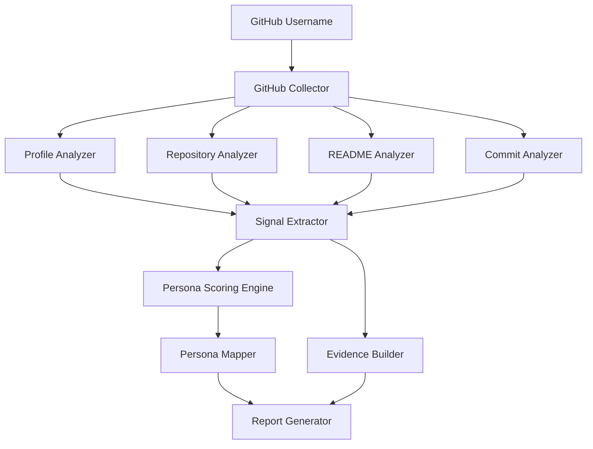

# GitHub Persona Analyzer

GitHub Persona Analyzer is a TypeScript + Express API that reads public GitHub profile data and generates an MBTI-style developer persona from repository, README, commit, and profile signals.

The goal is not to judge skill. It gives a lightweight, explainable view of how someone tends to build, explore, collaborate, and present their work.

## Features

- Serve a polished browser UI from the same Express app
- Select sample usernames, repository depth, persona dimensions, and evidence cards
- Analyze public GitHub profiles through the GitHub REST API
- Score three developer-persona axes: Builder vs Explorer, Solo Thinker vs Collaborator, Systematic vs Creative
- Generate a persona name, type code, confidence score, evidence list, and Markdown report
- Inspect README quality, language diversity, repository maintenance, commit style, and community signal
- Validate GitHub usernames and return clearer API errors
- Limit analyzed repositories with `?limit=20` to balance speed and detail

## API

Start the server:

```bash
npm install
npm run start
```

Open the UI:

```text
http://localhost:3000
```

Health check:

```text
GET /health
```

Analyze a profile:

```text
GET /analyze/:username
GET /analyze/:username?limit=30
```

Example:

```bash
curl http://localhost:3000/analyze/octocat?limit=10
```

The response includes:

- `profile`: public GitHub profile summary
- `persona`: type code, name, scores, summary, and confidence
- `evidence`: human-readable signals behind the result
- `signals`: raw scoring inputs
- `meta`: repository limit, fetch count, rate-limit data, and warnings
- `report`: Markdown report ready to display or save

## Personality Dimensions

### Builder vs Explorer

- Builder: completes and maintains structured projects
- Explorer: experiments across technologies, prototypes, and ideas

### Solo Thinker vs Collaborator

- Solo Thinker: mostly independent project ownership
- Collaborator: stronger public teamwork, forks, stars, followers, and shared-project signal

### Systematic vs Creative

- Systematic: structured documentation, clear commits, and maintainable repositories
- Creative: expressive, experimental, or visually distinctive project patterns

## Configuration

Create a local `.env` file from `.env.example`:

```bash
GITHUB_TOKEN=your_github_token_here
PORT=3000
```

`GITHUB_TOKEN` is optional, but strongly recommended because unauthenticated GitHub API limits are low.

## Scripts

```bash
npm run start      # Run the API with ts-node
npm run dev        # Run with nodemon
npm run typecheck  # TypeScript verification
npm run lint       # Alias for typecheck in this project
npm test           # Typecheck plus scoring regression tests
npm run format     # Prettier formatting
```

## How It Works



## Disclaimer

This project is for educational and exploratory purposes. Persona results are heuristic and not scientifically validated.
